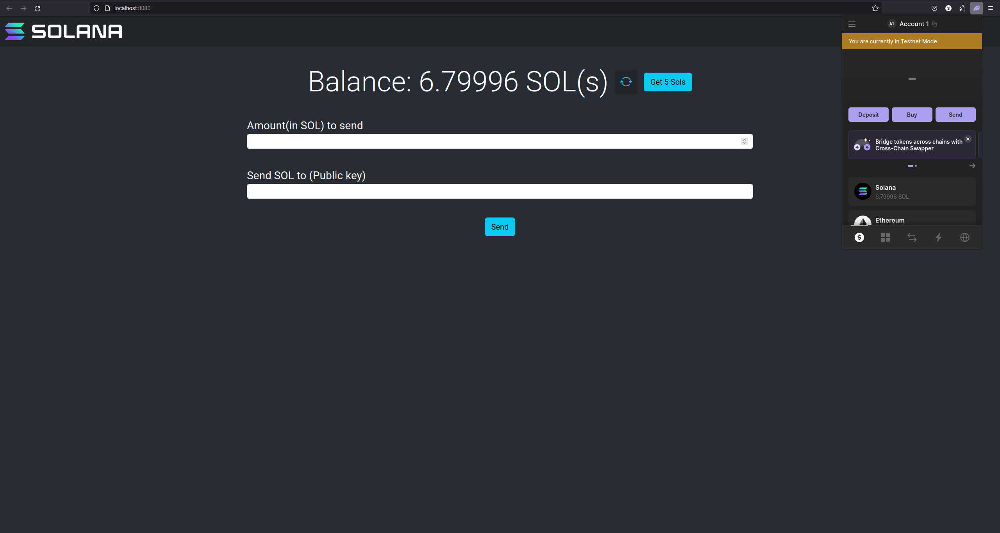

# Solana Frontend in Rust - Smart contract
This is a Smart Contract to connect with Solana using Rust, more specifically [Dioxus](https://dioxuslabs.com/).

## Prerequisites
1. This project uses [Axum](https://docs.rs/axum/latest/axum/) webserver which is a separate project written in Rust. see [here](https://github.com/bunnyBites/solana-rust-axum-backend) to know more. You might also check its [readme](https://github.com/bunnyBites/solana-rust-axum-backend/blob/main/README.md) section to know what details you need to provide to run your back-end server.

2. Phantom wallet - we will be using Devnet to test our program. You can also modify the code from the web server repo if you want to work with other environments.

## What to expect from this project?
1. Connect with Phantom Wallet and get the balance SOL(s) of your account.
2. Transfer SOL(s) from your account to another account (you might need the public key of the receiver's account).
3. You can also Airdrop or get 5 SOL(s) to your account.

## Project Preview
